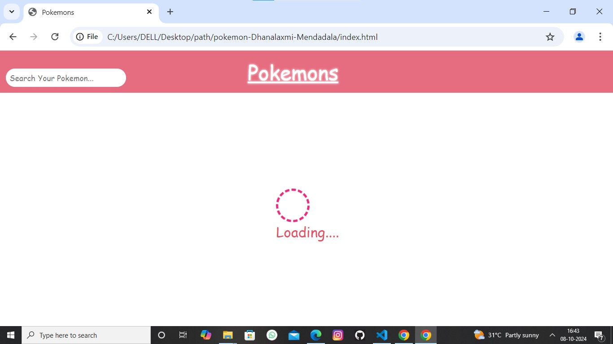
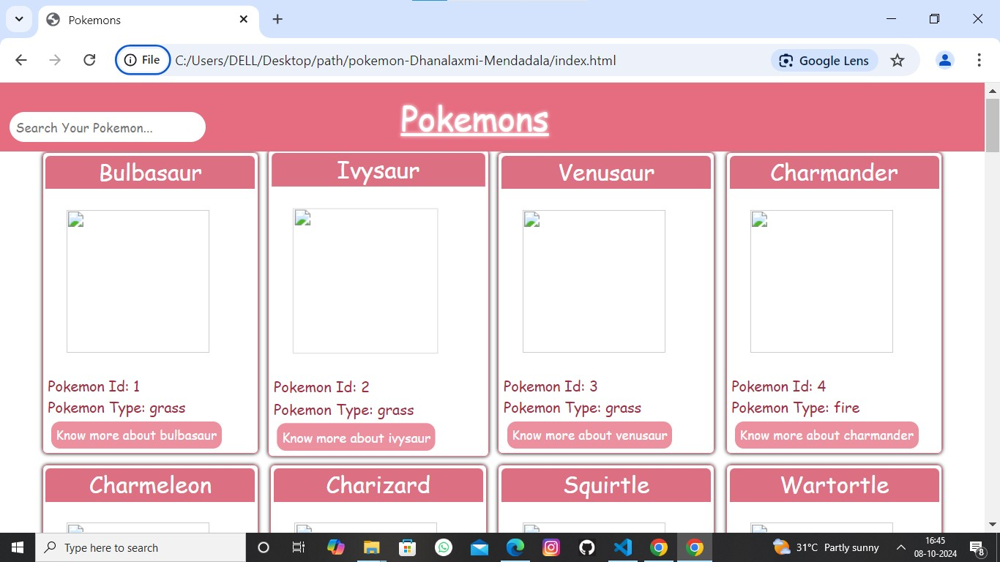

# Pokemon-Website

This Document shows overview of structure and content of **Pokemon-Website**

> * It is Single-Page Website

---

## Home page contains

* Header
* MainSection (it's Id is *main*)
* pokemonSection (it's Id is *pokemon*)

---

### Header 
 
 * SearchBar (it's id is *search* )
 >> It allow users to search  **pokemon** by its *id*,*name* and *type*

 * Heading (Pokemons)

----
### MainSection

> * **Intially :** 
              It shows a loader until data is fetched from [PokemonApi](https://pokeapi.co/api/v2/pokemon/?limit=10000&offset=0)

##### Intial View of Website

>* **Rendering :**
               When the  Data is fetched from  [PokemonApi](https://pokeapi.co/api/v2/pokemon/?limit=10000&offset=0) its referernce is <https://pokeapi.co/api/v2/pokemon/?limit=10000&offset=0>,it starts rendering all pokemons Data into Pokemon Divs by fetching data from each pokemon url ex:<https://pokeapi.co/api/v2/pokemon/1/>

 ##### Intial View of Website

Each Pokemon Div contains a **button** which allow users to view more about that **pokemon**

---

### PokemonSection

> * **Intially :**
      This section is not visible,When the user click on the  button in any pokemon div,This section get visible show all the details about that pokemon
#### PokemonSection contains

> * Pokemon Name
> * Pokemon Id
> * Pokemon Type
> * Pokemon Height
>  * Pokemon Weight
> * Pokemon Abilites
> * Pokemon Image
> * Pokemon Statstics
> * Pokemon Weakness
> * Pokemon moves

**Go Back Button :** This Button allow users to return **Home**(MainSection get appear)

---

