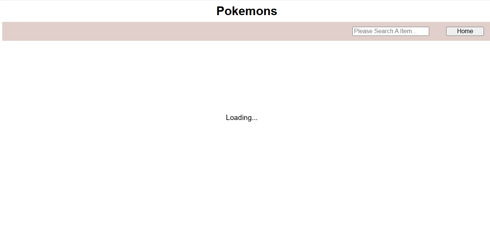
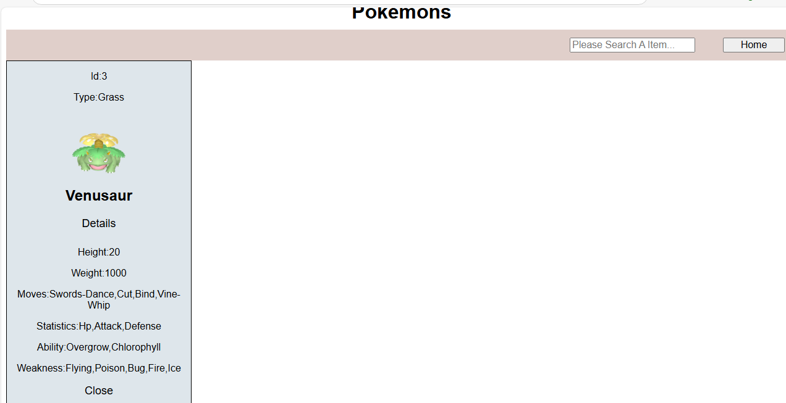
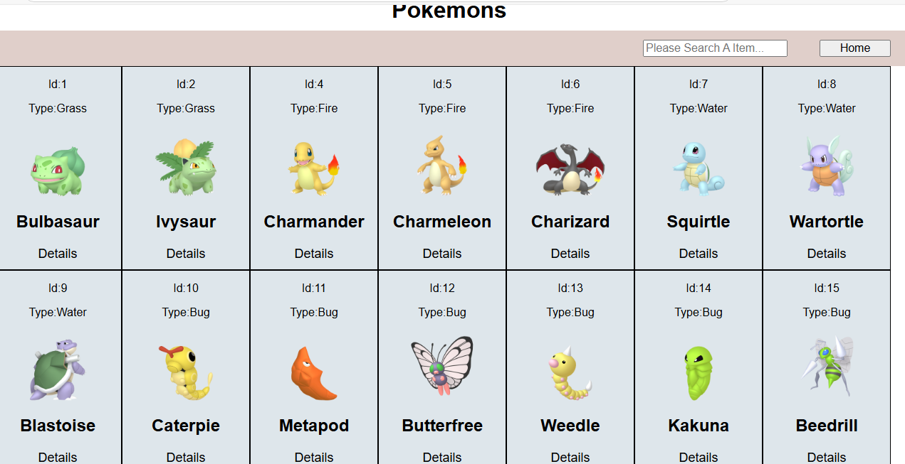

# Pokemon-Webpage: 

- *This documentaion represents the over-view of the* **pokemon-webpage.**

### Home-Page:
***The home page contains three sections:***

1. Title
2. Navbar
3. Pokemon Images

--- 

### 1. *Title:* 
It displays the title of the `Pokemon-webpage`.

--- 

### 2. Nav-Bar:

- **Search-Bar:** The home page has a search bar. When users input a Pokemon's name, type, or ID, the corresponding data will appear on the home page.

- **Home-Button:** After users search for something and view the data, they can click the home button to return to the home page.

> ***NOTE:*** If the Pokemons take time to load, a loader will be displayed. Once the loading is complete, the Pokemons will be visible on the webpage.
> 
> 
>>**Scroll:** When the webpage is scrolled, the navBar remains sticky, allowing easy interaction with the search bar.

---

### 3. Pokemon-Images:

 - ***Home Page Contains The A List Of Pokemons:***  
  Each Pokemon comes with some essential details Those are:

   - ***ID:*** The ID represents the unique identification number of each Pokemon.
   - ***Type:*** The type indicates the category to which the Pokemon belongs, such as Grass, Fire, or Water.
   - ***Image:*** The image showcases the visual representation of the Pokemon.
   - ***Name:*** The name signifies the specific name of the Pokemon, like Pikachu, Bulbasaur, or Charmander.
   - ***Details-Button:*** When users click this button, it will **display additional information about the Pokemon.** "
 
  

---

- *If you want more data about the Pokemons, then you `tap on the Details button`, you'll discover the following additional details for each Pokemon:*

  - ***Height:*** The measurement of the Pokemon from top to bottom.
  - ***Weight:*** The heaviness of the Pokemon.
  - ***Moves:*** The special actions and abilities the Pokemon can execute,*Bulbasaur-Moves:razor-wind,swords-dance,cut,bind*.
  - ***Statistics:*** Data showing various attributes of the Pokemon,*Charmander-Statistics:hp,attack,defense.*
  - ***Ability:*** The unique skill by the Pokemon,*Pikachu-Ability:static,lightning-rod.*
  - ***Weakness:*** The specific disadvantages of the Pokemon,*Venusaur-Weakness:flying,poison,bug,fire,ice*.
  - ***Close-Button:*** This button allows you to exit and close the extra details.

 

 > ***Note:*** When you click the "More Details" button, that Pokemon will display both previous and additional details. However, if you click the "Close" button, that Pokemon will no longer appear on the homepage; it completely disappears.During this time,the home button will not work.



---

 ### *There are some APIs used on this Pokemon webpage. Those are:* ###

**1.*Pokemon-Data:***

-  *Description:* Used for fetching pokemon information.
    - End-Point : https://pokeapi.co/api/v2/pokemon  
- *Description:* Used for retrieving required information about pokemon.
    - End-Point:https://pokeapi.co/api/v2/pokemon/1/  

**2.*Pokemon-Weakness:***
- *Description:* Used for retrieving pokemon weakness.
  - End-Point:https://pokeapi.co/api/v2/type/1/

 ### *Fetch-Method:*

The website utilize the `fetch()` method for fetching the data from the API.

  ```javascript
  fetch('https://pokeapi.co/api/v2/pokemon/1/')
  .then(response => response.json())
  .then(data => console.log(data));
  .catch(error => console.log('Error:',error));
  ```

  ---

