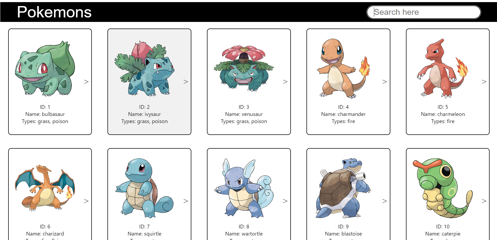
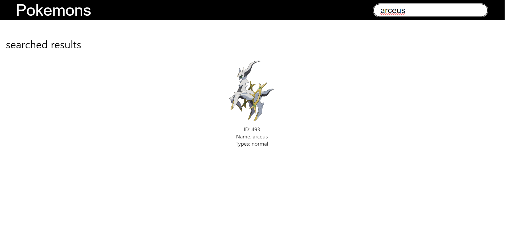
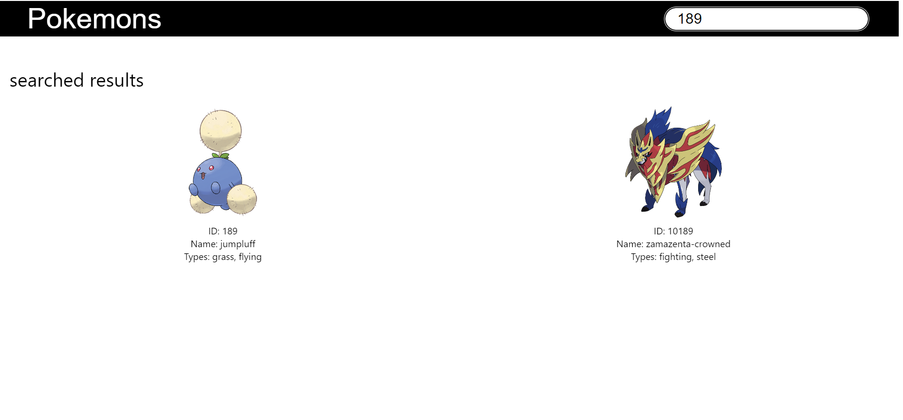
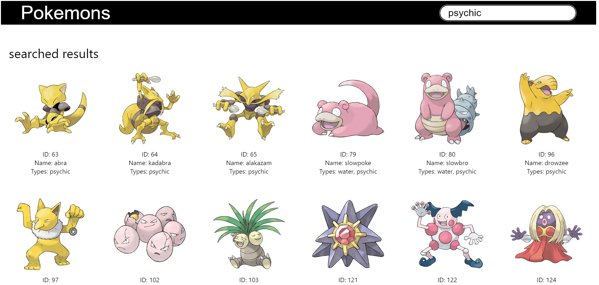
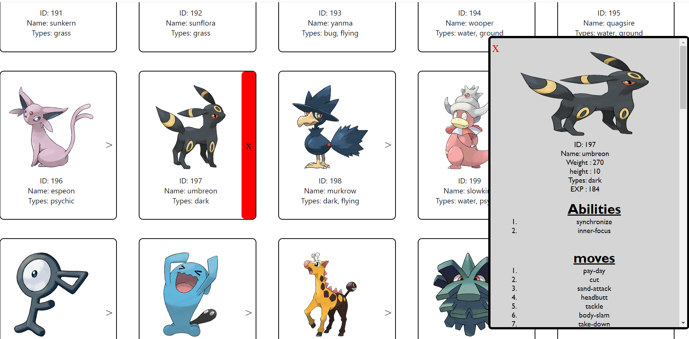

# pokemon-assignment

## Introduction

This is a Pokémon website that allows users to explore almost all Pokémon, including their stats and abilities.

## Accessing Requirements

* **Accessing the Page:** Enter the [URL](index.html) in your trusted ***Browser***.
* **System Requirements:** Any browser version above.

## User Guide

1. **Layout:** The webpage layout is clean and includes the title, [search bar](#), and Pokémon cards.
   
   * **Initial Look:** 
     * Sample image of the homepage.
     

   * **Pokémon Card:** These cards display details of the Pokémon (ID, Name, Types) and an expander button (***>***) that enables the user to get more details about that Pokémon.
     * Example of a Pokémon card:
     .

   * **Search Bar:** Enter the Pokémon name, ID, or type you want to search for in the upper right corner of the webpage.
     * To clear the searched Pokémon, delete all characters in the search bar to return to the original state with all Pokémon.
   
   * **Samples:**
     * Search by name:
     
     * Search by ID:
     
     * Search by type:
     

   * **All Details:** To see all details like stats, abilities, and moves of a Pokémon (including ID, name, and types), click on the symbol (***>***).
     * Sample image of detailed info:
     

## API Integration

* The website fetches Pokémon data from the [Pokemon API](https://pokeapi.co/).
* Data is retrieved in real-time, ensuring users have the most current information available.

## Contact

* For any queries or help regarding the webpage, please contact us at [pokemon@poke](mailto:abc@gmail.com).
* We welcome your valuable feedback to improve our site or report any errors at [feedback.co](mailto:feedback@gmail.com).
