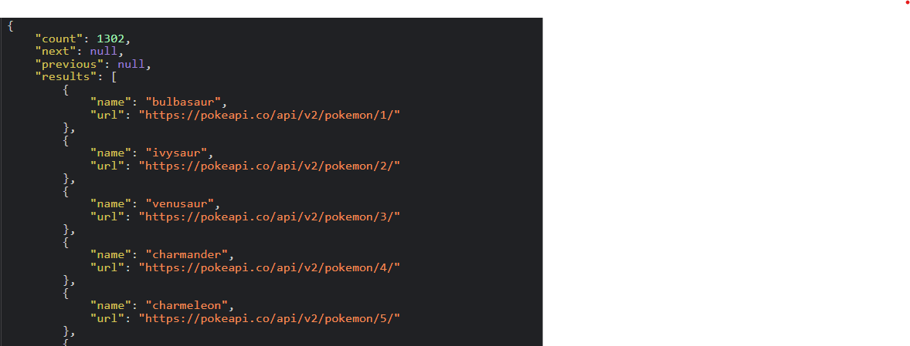
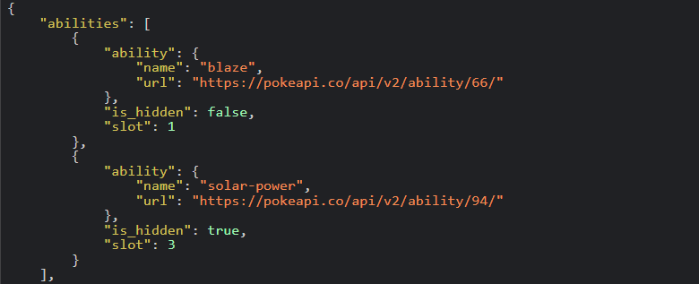
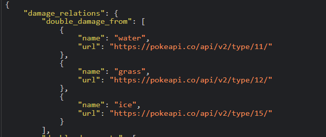

# Pokemon Website

## Overview

This website allows user to see information about different pokemons using the data fetched from the Pokemon API ([pokemonApi](https://www.pokeapi.co)). You can search Pokemons and view their details like their moves, type, abilities, statistics and weaknesses.

## Features

- **Search Functionality** : You can search Pokemons by their name, id and you can filter pokemons based on their type.
- **Detailed Pokemon Information** : Clicking the "Show More" button displays detailed stats about the Pokemon. 
- **Loader** : Displays a loader while fetching the data from the Pokemon API.

## API's Used In this Website

### PokeAPI

- **Main URL** - `https://pokeapi.co/api/v2/`

### API Endpoints

1. **For Getting All Pokemons**
- **Endpoint** : `https://pokeapi.co/api/v2/pokemon?limit=100000&offset=0`
- **Description** :This Endpoint Fetches a list of all Pokemon. The data includes names and URLs for each Pokemon.

  

2. **For Getting Pokemon Details**
- **Endpoint**: `https://pokeapi.co/api/v2/pokemon/{id}`
- **Description**: This Endpoint Fetches detailed information about a specific Pokemon by its ID. This includes:
  - ID
  - Name
  - Height
  - Weight
  - Sprites
  - Abilities
  - Moves
  - Types

  
  
3. **For Getting Pokemon Type Details**
- **Endpoint** : `https://pokeapi.co/api/v2/type/{id}`
- **Description**: This Endpoint fetches the pokemon data on specific type details, including weaknesses, statistics Example Image.

  
  