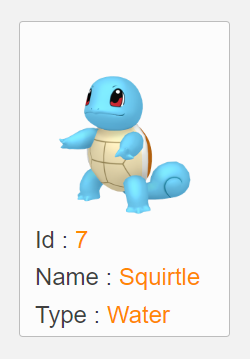
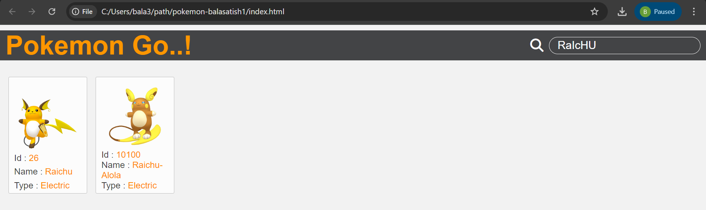
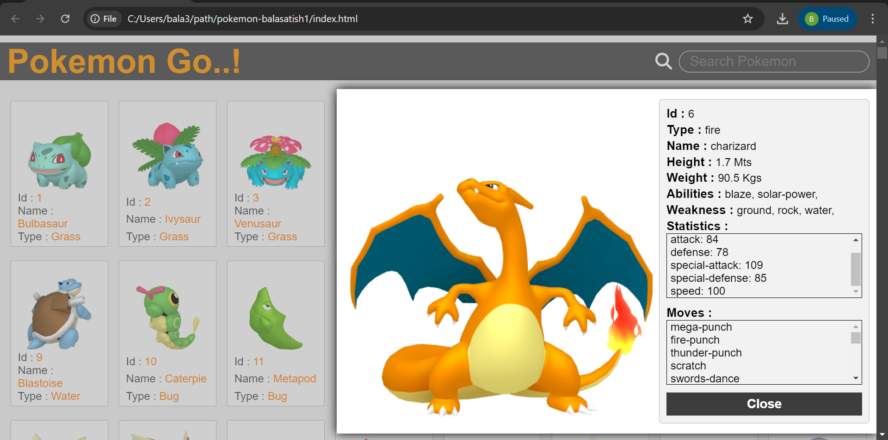

# Pokemon Go...

## Intro

Pokemon Go is a website, which allows the user to explore various **POKEMONS** at one place.

The user will find **pokemon go..** (heading) and **1000+** pokemons on the UI. Each pokemon is rendered with an **_image_** and **_primary details_** of the respective pokemon.

On opening the page the user will be able to see a **15** - **16** pokemons without scrolling.

## What The Pokemon Initially Contains.

- `Image` - Small **_Picture_** of the Pokemon

- `Id` - A **_Unique Number_** given to identify the Pokemon

- `Name` - It is **_Name_** of the Pokemon

- `Type` - Based on its **_Evalution_** and **_Abilities_**, the **category** it belongs to

Just make a look on the below picture !!

## Search Your Pokemon

It also provides a search feature to find your desired pokemon, The user could be allowed to search the pokemon only by it's _`Name`_, _`Id`_ and _`Type`_ individually.

Just make a look on the below picture !!

## Get More Details

Click the desired one you want . By clicking on the Pokemon drop down box will be opened on the right side.

The drop down box will contains the following details of the pokemon.

- `image`
- `Id`
- `Name`
- `Type`

### New Details

- `Height` - Height of the pokemon in **_Mts_**.
- `Weight` - Weight of the pokemon in **_Kgs_**.
- `Abilities` - **_Special passive effects_** that Pokemon have in battles and outside also.
- `Weakness` - From which type of pokemons it will get **_double demage_**.
- `Statistics` - Various **_numerical values_** that define a Pokemon's abilities in battle.
- `Moves` - The **_attacks_** or **_techniques_** that Pokemon can use in battles.

Just make a look on the below picture.

> NOTE : When the drop down is opened !!
>
> > The other features like : search, clicking pokemon won't work until you **close** the drop down

## External Resources
