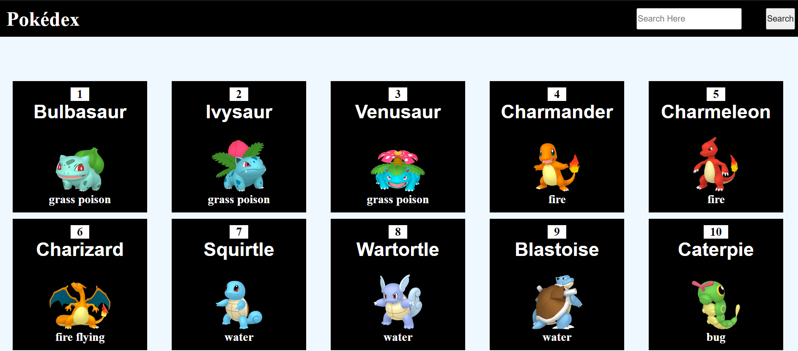

# Pokédex

> Our webpage displays the all possible *Pokémons* in ***Pokémon series*** and many more.

> The [Pokémon API](https://pokeapi.co/api/v2/)  is used in this Pokédex webpage.

---

## This is the inteface of our website



---

## Features of our website

1. [Search](#1-search)
   1. [how to search](#how-to-use-search-feature)
2. [Pokémon Details](#2-pokemon-details)
   1. [how to get more details](#how-to-get-the-details)

---

### 1. Search

---

> This **Search** function helps you to search the Pokémons in any aspect like Pokémon name, Pokémon id, Pokémon type. 
For instance:- if you search pikachu, you will get results of it.
    
#### how to use search feature?

```
Step-1: Click on the Search bar which is on top right.
Step-2: Type the word that you want to search.
Step-3: Click on the Search button which is on right side.
Step-4: Wait for some time and get your Pokémon results.
```

---

### 2. Pokemon Details

---

> This feature makes you to get the more details of a *Pokémon* when you click on it.

#### how to get the more details of a Pokémon?
```
Step-1: Scroll search for your required Pokémon.
Step-2: Click on a Pokémon that you want to get the more details.
Step-3: Get your details

```
---
