# Pokédex.

This ***Pokédex*** tool was made to help the *pokemon enthusiastics* a interactive platform which can help them to find there favourate pokemons and there details at one place.


## Table of Contents :

- [Introduction](#introduction)
- [Features](#features)
    - [Basic Search](#basic-search)
        - [Search by Name](#search-by-name)
        - [Search by Id](#search-by-id)
        - [Search by Types](#search-by-types)
        - [Pokemon Not found](#pokemon-not-found)
    - [Pokemon Details](#pokemon-details)
        - [Basic Details](#basic-details)
            - [Pokemon Name](#pokemon-name)
            - [Pokemon Id](#pokemon-id)
            - [Pokemon Image](#pokemon-image)
            - [Pokemon Types](#pokemon-types)
        - [Advanced details](#advanced-details)
            - [Pokemon Characteristics](#characteristics)
                - [Base Experience](#base-experience)
                - [Height](#height)
                - [Weight](#weight)
            - [Pokemon Stats](#stats)
                - [Health](#health)
                - [Attack](#attack)
                - [Defence](#defence)
                - [Special Attack](#special-attack)
                - [Special Defence](#special-defense)
                - [Speed](#speed)
            - [Pokemon Moves](#pokemon-moves)
            - [Pokemon Abilities](#pokemon-abilities)
            - [Pokemon Weakness](#pokemon-weakness)
- [Implementation](#implementation)
    - [Project Setup](#project-setup)
    - [Reference](#reference)
        - [MDN documentation for fetch](#mdn)
        - [Pokeapi documentation for using its api](#pokeapi-documentaion)
    - [APIs](#apis)
        - [API for finding the list of pokemons](#api-for-getting-list-of-pokemons)
        - [Api to get details of single pokemon](#api-for-getting-details-of-single-pokemon)
        - [APi to get weakness](#api-for-getting-list-weakness-types-of-a-pokemon)

# Introduction
This Pokédex tool was made to help the *pokemon enthusiastics* a interactive platform which can help them to find there favourate pokemons and there details at one place. This tool displays your favourate pokemon data in a interactive way with features like searching, viewing there moves, abilities and also knowing your childhood *Un-Beatable* pokemons weakness.

# Features
I had tried to include most of the features which are truely nessesary to vide to our nostalgia. I made this like our favourate ***Pokedex***, which we desired why can't we have such in our childhood. This online **Pokedex** tool has features like :
> This **pokedex** tool curently only facilitates the basic featurs like searching, details show-cases, etc. We are working to bring you new advanced features very soon. 

## Basic Search
this search functionality can search the pokemons based on the query typed on the pokedex search box. the query can be a [Name](#search-name), [Id](#search-id), [Types](#search-type).

  - ### Search by Name
     By using the *search* functionality we can search the pokemon with there [Names](#name). The names can be not accurate, not full, even if it is a mix of different cases it works and fetches the pokemon.
     - #### Example :
        Now let us try to find which pokemon including `char`. the steps to find them are :
        1. First click on the search bar which is placed on the top of the webpage.
        2. Next, type your desired name (*char*). And press ```enter```.
        3. It fetches all the pokemons which shares the name *char*.
        ### Pokemons including **Char** in ther name :
        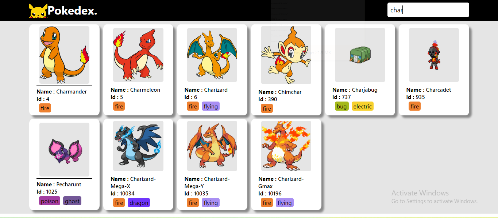
  - ### Search by Id
     By using the *search* functionality we can search the pokemon with there [Id](#id) numbers. This feature alloys you to fetch all the pokemons whose id number includes your queried id, so that even if your id is not accurate we can find the pokemon with the approxe id.
     - #### Example :
        Now let us try to find which pokemon has `100` in there id. the steps to find them are :
        1. First click on the search bar which is placed on the top of the webpage.
        2. Next, type your desired *Id* (*100*). And press ```enter```.
        3. It fetches all the pokemons which has *100* in there id.
        ### Pokemons with id including **100**
        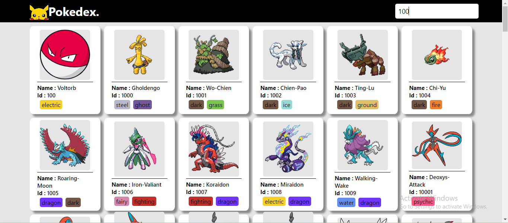
  - ### Search by Types
     By using the *search* functionality we can search the pokemon with there [Types](#types). If we want to know what pokemons come under a specifed type we can search for the type and it fetches all the pokemons which shares the specifed type.
     - #### Example :
        Now let us try to find which pokemon comes under the `fire` type. the steps to find them are :
        1. First click on the search bar which is placed on the top of the webpage.
        2. Next, type your desired *type* name. And press ```enter```.
        3. It fetches all the pokemons which shares the type
        ### Pokemons fetched of **Fire** type
        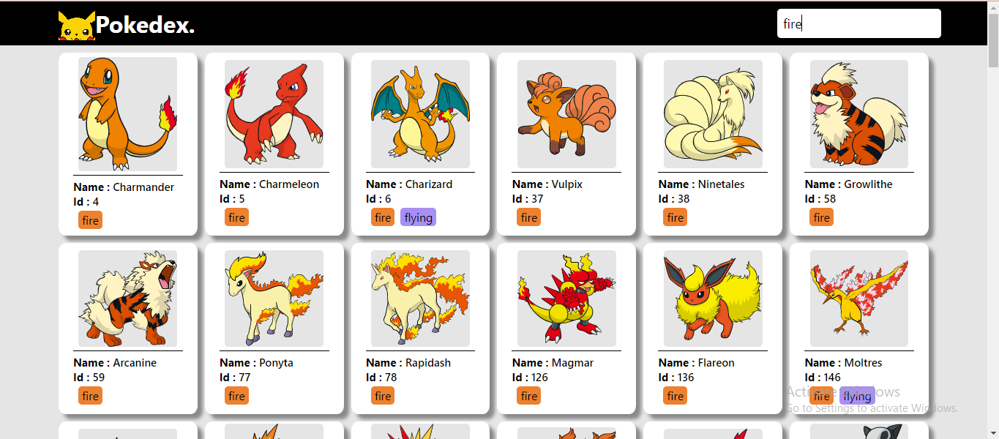
        ### Pokemons fetched of **Electric** type
        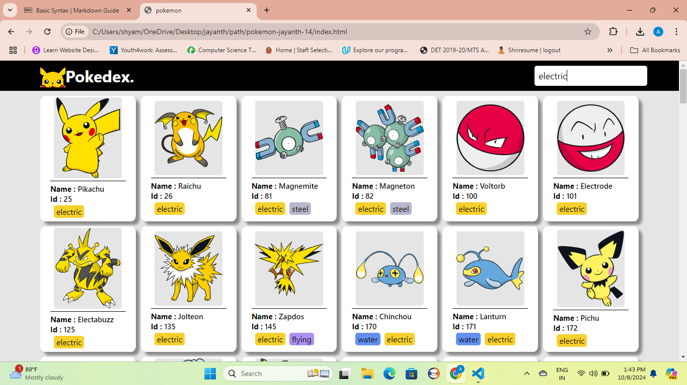
 - ### Pokemon Not found
    when ypu search for a pokemon by name or id or type, it fetches them. if the pokemon which you are searching doesn't exist, then displays a **pop-up** telling pokemon not found
    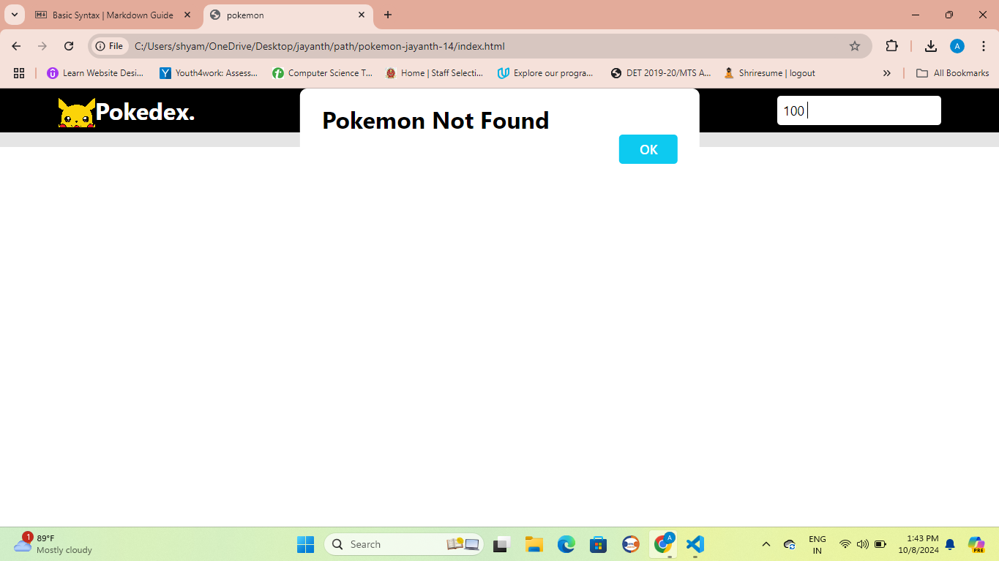
## Pokemon Details
This ***Pokedex*** tool also showcase the details of each pokemon from basic details like *name, id, and type* to advaced details like *experience, moves, abilities, ...*.
> The ***Details*** functionality has two parts, one being the basic details and other being advanced details, And to access the advanced details click on the pokemon whose full details you want to know.

 - ### Basic Details
    when you open our webpage, after loading had completed you will notice a grid of cards. Each having basic details of single pokemon. It has details like :
    - #### Pokemon Name
      This field on the Card has the **name** of the pokemon whose data it is showing. It shows the name in the *captilized* style.
    - #### Pokemon Id
      This field on the Card has the **Id** number of the pokemon whose data it is showing.
    - #### Pokemon Image
      This field on the Card showcases the **Image** of the pokemon whose data it is showing. if the api has ``svg`` image, then it renders it. if it does not have it renders normal png image .
    - #### Pokemon Types
      This field on the Card has all the **types** names of the pokemon whose data it is showing. It shows each type like a *button-like* style with backgroung colour which matches its nature.
    ### An image of grid of cards show-caseing different pokemons
    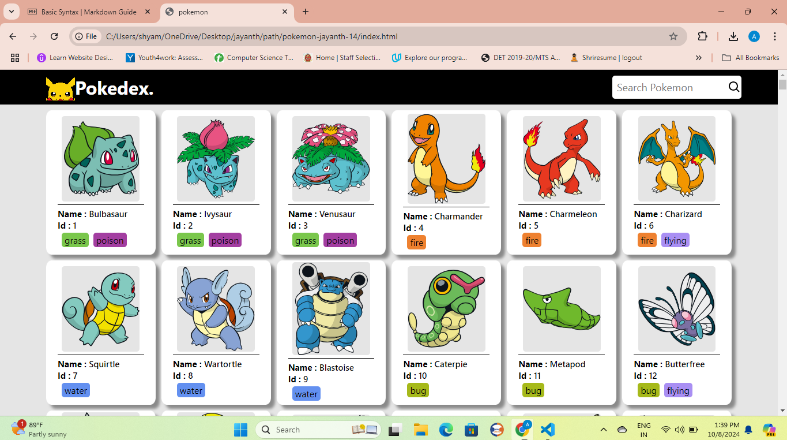
    ### An image of card show-caseing ***Ivysuar***  
    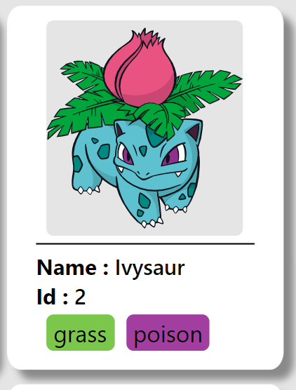
 - ### Advanced Details
    This functionality show-cases the Advanced details of a **Pokemon** like its characteristics like *base experience, height, weight* and more.

    > These advanced details can be accessed by ```clicking``` on the pokemon card for which you want to access the advanced details.
    - ### Characteristics
        This consists of information about the pokemon's physic and charcteristics.
        - #### Base Experience
            It has the amount of experience recieved on defeating this pokemon.
        - #### Height
            It has the height of the pokemon in *dm (**decimeter**)*.
        - #### Weight
            It has the weight of the pokemon in *hg (**hectograms**)*
        ### An image showcasing different characteristics of a pokemon.
        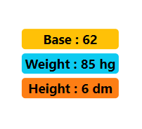
    - ### Stats
        This consists of various stats the pokemon supports and its values with visual representation of the value with colours.
        - #### Health
            This stat determines a Pokémon's hit points, or the amount of health it has before fainting.
         - #### Attack
            This stat determines a Pokémon's physical power, the amount of damage it causes for each punch.
         - #### Defence
            This stat determines how much damage a Pokémon can resist from physical attacks.
         - #### Special Attack
            This stat determines a Pokémon's special power.
         - #### Special Defence
            This stat determines how much damage a Pokémon can resist from special attacks.
         - #### Speed
            This stat determines the order in which a Pokémon attacks in turn-based battles.
        ### An image showcases various stats and its values
        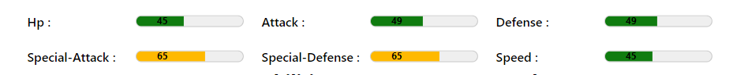
    - ### Pokemon Moves
        This has the list of moves along with learn methods and level details pertaining to specific version groups. The pokemon can use these moves to fight and defeat other pokemon.

        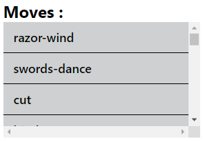
    - ### Pokemon Abilities
        This has the list of the pokemon can have. The pokemon can use these abilities to fight and defeat other pokemon.
        
        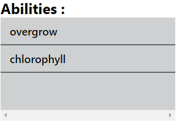
    - ### Pokemon Weakness
        This has the list of types from which the pokemon recives the double damage from indcating it is weak against poskemons of these types.

        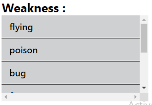
    ## An image show-caseing all the advanced details
    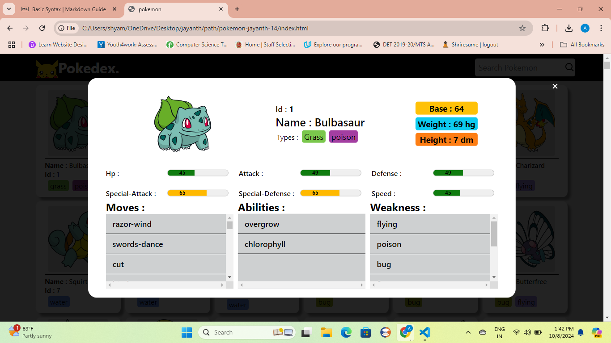
# Implementation
This section of the documentation the project setup details, refernces used in building this, and the api's used for data.
 - ## Project Setup
    This project has the following file structre

    ```
    |- index.html
    |- src/
    |  |- images/
    |  |  |- pokeball.png
    |  |  |- logo.jpg
    |  |  |- /search
    |  |- js/
    |  |  |- add.js
    |  |  |- color.js
    |  |- css/
    |  |  |- style.css
    |  |  |- info.css
    |  |- all other html files
    |- readme.md
    |- instuctions.md
    ```
 - ## Reference
    For this project I had used two documentations, one is **MDN** for documentation on fetch api and other being **Pokeapi documentation** for documentation on how to use its api and what response each of its api returns.
    - ### MDN
        This documentation of [MDN on FetchApi](https://developer.mozilla.org/en-US/docs/Web/API/Fetch_API/Using_Fetch, "Takes to Mdn page with documentation on Javascript fetchApi") has been a great help on understanding and using the fetchApi in practical purpose.
    - ### Pokeapi documentaion
        The [documentation provided by Pokeapi](https://pokeapi.co/docs/v2) had clear, consise and detailed way of using its various *Api* endpoints, helping clear understanding on when and how to use each api endpoints for our requirements.
- ## APIs
    For this tool, I had used the Api provided by the [***PokeApi***](https://pokeapi.co/), It provides various end points for deferant requirements with proper documentation on how to use each them and what might be its response.
    - ### Api for getting list of Pokemons
        I had used the Api provided by the pokeApi with end-point `pokemon` to get list of pokemons. When requested, this api end-point provides response with the total count of **Pokemons available through API**, list of twenty pokemons with name and url of the api end-point to get the details of that pokemon each and the urls for  end-points for retriving previous and next twenty pokemons.
        #### API END-POINT :
        ```
        https://pokeapi.co/api/v2/pokemon/
        ```  
    - ### Api for getting details of **Single Pokemon**
        I had used the Api provided by the pokeApi with end-point `pokemon/{name or id}` to get full details of a pokemon. when requested this provides response with various details of the pokemon on whose end-point got requested
        #### API END-POINT :
        ```
        https://pokeapi.co/api/v2/pokemon/{name or id}
        ```  
    - ### Api for getting list weakness types of a Pokemon
        I had used the Api provided by the pokeApi with end-point `type/{type-name}` to get information of given type . When requested this provides response with various information related to the type, damage-relations, moves related to this type, pokemons of this type and so on.
        #### API END-POINT :
        ```
        https://pokeapi.co/api/v2/type/{type-name or type-id}
        ```  

    

