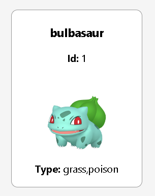
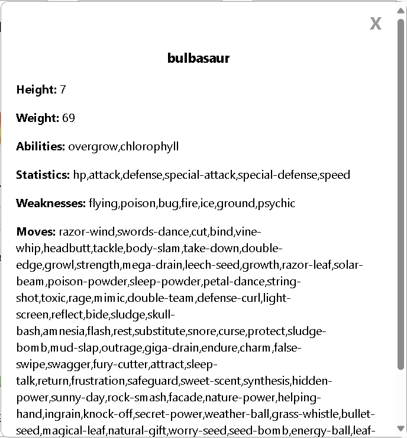

# Pokédex

>overview
- Loader
- Searchbar
- PokémonDetails
- API's used

## Loader

The loader is a part of the Pokédex application that handles the loading state.

The loader's job is to keep you informed while the app fetches or processes data. Once everything is ready, the loader disappears, and you can see the Pokémon details you're looking for.

## SearchBar

The search bar is a crucial part of the Pokédex application that allows users to search for Pokémon.

The search bar is a simple text input field where users can type the name of the Pokémon, id of the Pokémon or types of the Pokémon and when click on the search button then the details of that Pokémon will displayed on the page.

> ***🔍 searchbar***

## PokémonDetails

The Pokémon Details component is a part of the Pokédex application that displays the details of a pokémon like 

- id, name, types, weight, height, abilities, moves, and stats.

> ***🎴 Pokémon card:***

Basically the card have some details of the Pokémon like name, id, type and image of the Pokémon.

When the user click on a specific Pokémon card then the more information about that Pokémon will be displayed at the right side of the page.

It contains all the details about the Pokémon like it's height, weight, abilities, statistics, weaknesses, moves and
It has a **X** button to close the details of the Pokémon to see the full page as before. 

> ***📜 Full deatails:***

The Pokémon Details component uses the API to fetch the details of the Pokémon and displays it on this website.

## API's used

The application uses the following APIs: *__[pokeAPI](https://pokeapi.co/ "pokiAPI")__*
- PokeAPI: This API is used to fetch the details of the Pokémon.

Fetched PokémonData from here **_[pokemonData](https://pokeapi.co/api/v2/pokemon?limit=100000&offset=0 "link to the api to get pokemon data")_**.

collected the more information of the specific pokémon by the [url](https://pokeapi.co/api/v2/pokemon/) provided the above api link there by fetching that url to get the all the information related to that Pokémon.

&copy written by <ins>sohan</ins>
